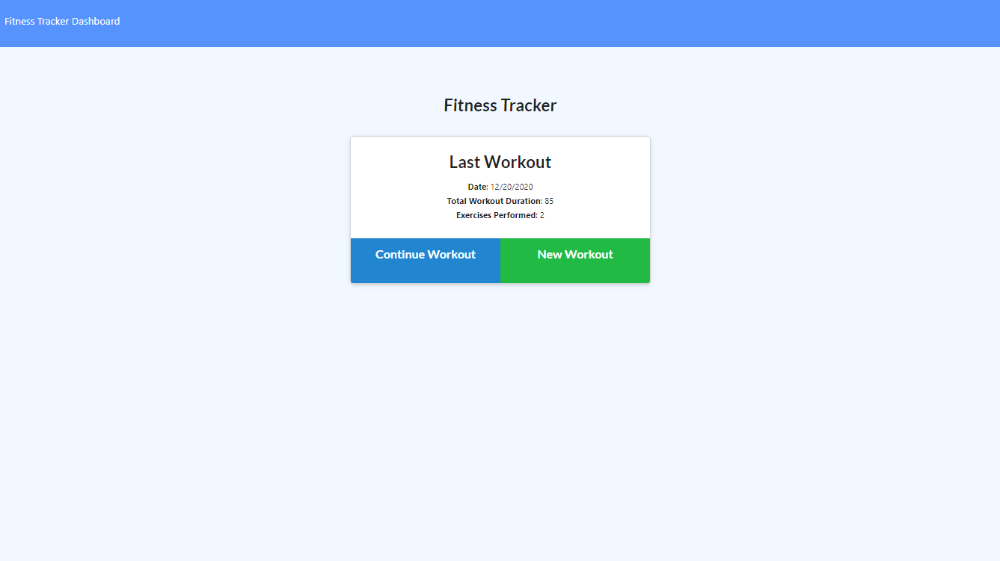
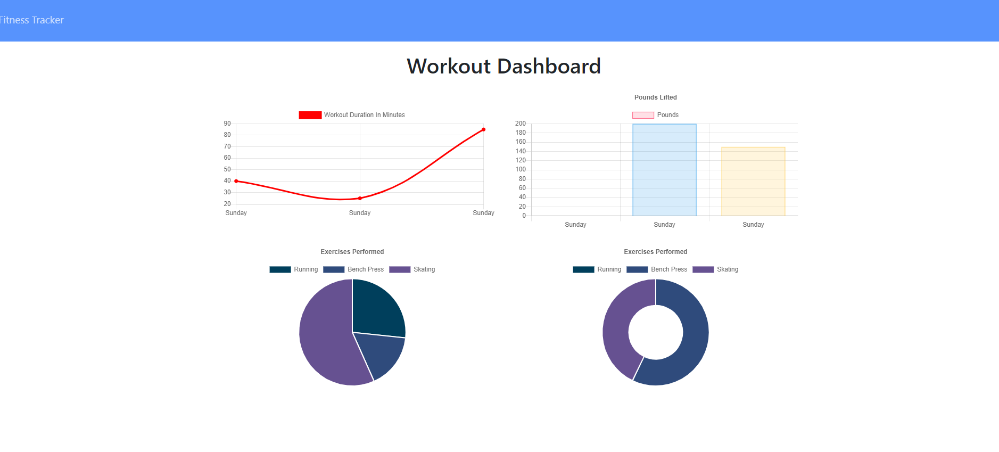
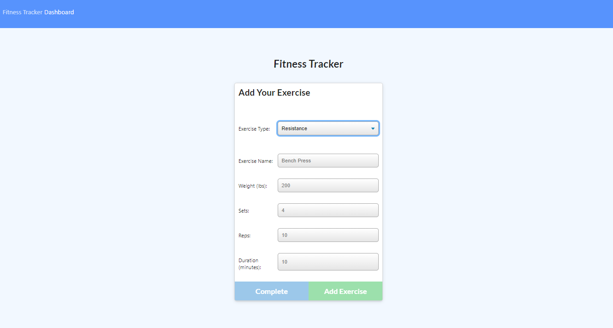
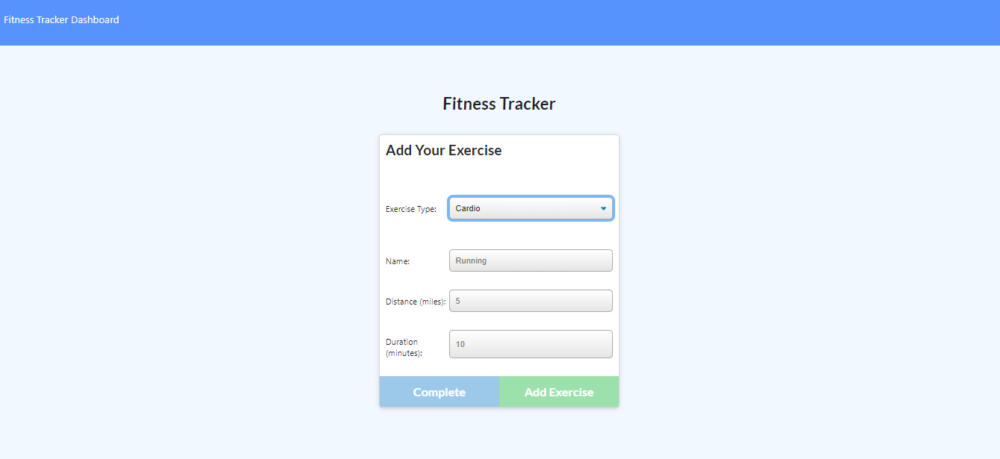

# Workout Tracker 

This Workout Tracker app allows users to track their daily workouts.  

The complete webpage has been developed in node.js, using JQuery to manipulate the DOM, mongoose to manage the mongo dB, JQuery AJAX method to make the call out to the API, Bootstrap for styling purposes.

[Click here to go to the live site](https://)

[Click here to go to the Repository](https://github.com/chernanma/Workout-Tracker)

---

## User Story

* As a user, I want to be able to view create and track daily workouts. I want to be able to log multiple exercises in a workout on a given day. I should also be able to track the name, type, weight, sets, reps, and duration of exercise. If the exercise is a cardio exercise, I should be able to track my distance traveled.

---

## Acceptance Criteria

When the user loads the page, they should be given the option to create a new workout or continue with their last workout.

The user should be able to:

  * Add exercises to the most recent workout plan.

  * Add new exercises to a new workout plan.

  * View the combined weight of multiple exercises from the past seven workouts on the `stats` page.

  * View the total duration of each workout from the past seven workouts on the `stats` page.
---
## Technologies

- Node.js
- JQuery
- Boostrap
- Express
- Mongo
- Mongoose
- MongoDB Atlas

---

## Screenshots

### Stats Page

### Adding new Resistance Exercise to Workout

---

### Adding new Cardio Exercise to Workout

---
## References

- Mongoose, https://www.npmjs.com/package/mongoose

- Node.js, https://nodejs.org/en/docs/

- Bootcampspot, John Hopkins Univetsity, NoSQL Project 

- Bootstrap, https://getbootstrap.com/

- JQuery W3Schools, https://www.w3schools.com/jquery/

- MongoDB Atlas, https://www.mongodb.com/cloud/atlas

